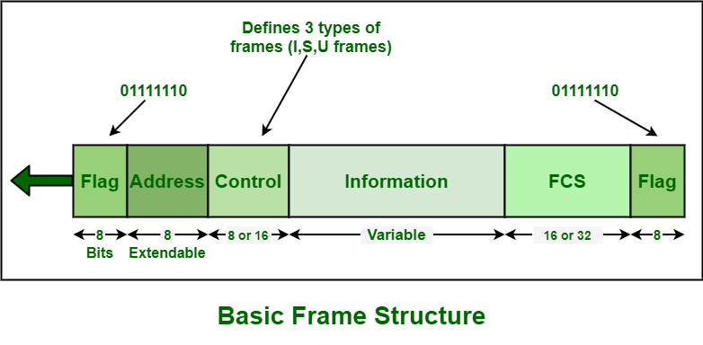
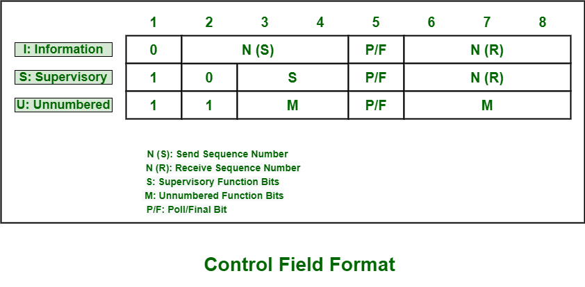

## Estrutura do Quadro de HDLC

O controle de link de dados de alto nível **(HDLC)** geralmente usa o termo “quadro” para indicar e representar uma entidade de dados ou um protocolo de unidade de dados geralmente transmitido ou transferido de uma estação para outra. Todo e qualquer quadro no link deve começar e terminar com o campo de sequência de sinalização (F). Cada um dos quadros em **HDLC** inclui principalmente seis campos. Ele começa com um campo de sinalizador, um campo de endereço, um campo de controle, um campo de informações, um campo de sequência de verificação de quadro (FCS) e um campo de sinalizador final. O campo sinalizador final de um quadro pode servir como campo sinalizador inicial do próximo quadro em transmissões de quadros múltiplos.

A estrutura básica do quadro do protocolo **HDLC** é mostrada abaixo:

 

 

 

Tamanho de campos diferentes:

 

| Nome do Campo | Tamanho em bits |
| ------ | ----------- |
| **Flag Field** |  8 bits |
| **Address Field** | 8 bits |
| **Control Field** | 8/16 bits |
| **Information Field** | Variável (não usado em alguns tipos de quadros HDLC). |
| **FCS (Frame Check Sequence)** |  16/32 bits  |
| **Closing Flag Field** | 8 bits |
 
 

Vamos entender esses campos em detalhes:

1. **Flag Field:** O campo sinalizador geralmente é responsável pelo início e término da verificação de erros. No protocolo **HDLC**, não há bits de início e parada. Assim, o campo sinalizador está basicamente usando o delimitador `0x7e` para simplesmente indicar o início e o fim do quadro.
É uma sequência de **8 bits** com um padrão de bits `01111110` que basicamente ajuda a identificar o início e o fim de um quadro. Este padrão de bits também serve como um padrão de sincronização para o receptor. Esse padrão de bits também não pode ocorrer em nenhum outro lugar dentro de um quadro completo.

2. **Address Field:** O campo de endereço geralmente inclui o endereço **HDLC** da estação secundária. Ajuda a identificar que a estação secundária enviará ou receberá o quadro de dados. Este campo também geralmente consiste em **8 bits**, portanto, é capaz de endereçar `256` endereços. Este campo pode ter `1 byte` ou vários bytes, depende dos requisitos da rede. Cada byte pode identificar até **128 estações**.
Esse endereço pode incluir um endereço específico, um endereço de grupo ou um endereço de `broadcast`. Um endereço primário pode ser uma fonte de comunicação ou um destino que elimina a necessidade de incluir o endereço do primário.

3. **Control Field:** HDLC geralmente usa esse campo para determinar como controlar o processo de comunicação. O campo de controle é diferente para diferentes tipos de quadros no protocolo **HDLC**. Os tipos de quadros podem ser quadro de informação (quadro I), quadro de supervisão (quadro S) e quadro não numerado (quadro U).

 

 

Este campo é um segmento de quadro de 1 a 2 *bytes* geralmente necessário para controle de fluxo e erro. Este campo consiste basicamente em `8 bits`, mas pode ser estendido para `16 bits`. Nesse campo, a interpretação dos bits geralmente depende do tipo de quadro.

4. **Information Field:** Este campo geralmente contém dados ou informações dos usuários que o remetente está transmitindo ao receptor em um quadro I e camada de rede ou informações de gerenciamento em quadro U. Também consiste em dados do usuário e é totalmente transparente. O comprimento desse campo pode variar de uma rede para outra.
O campo de informação nem sempre está presente em um quadro HDLC.

5. **Frame Check Sequence (FCS):** O **FCS** é geralmente usado para identificação de erros, ou seja, detecção de erros **HDLC**. No **FCS**, o código **CRC16** (Verificação de redundância cíclica de `16 bits`) ou `CRC32` (Verificação de redundância cíclica de `32 bits`) é basicamente usado para detecção de erros. O cálculo do **CRC** é feito novamente no receptor. Se de alguma forma o resultado for ligeiramente diferente do valor no quadro original, um erro será assumido.

Este campo pode conter `2 bytes` ou `4 bytes`. Este campo tem um total de `16 bits` necessários para a detecção de erros no campo de endereço, campo de controle e campo de informações. O **FCS** é basicamente calculado pelo remetente e pelo destinatário de um quadro de dados. O **FCS** é usado para confirmar e garantir que o quadro de dados não foi corrompido pelo meio usado para transferir o quadro do remetente para o destinatário.