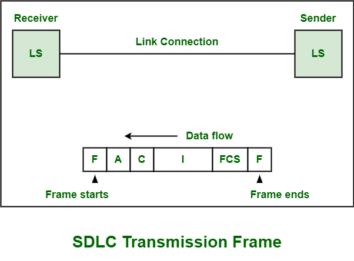
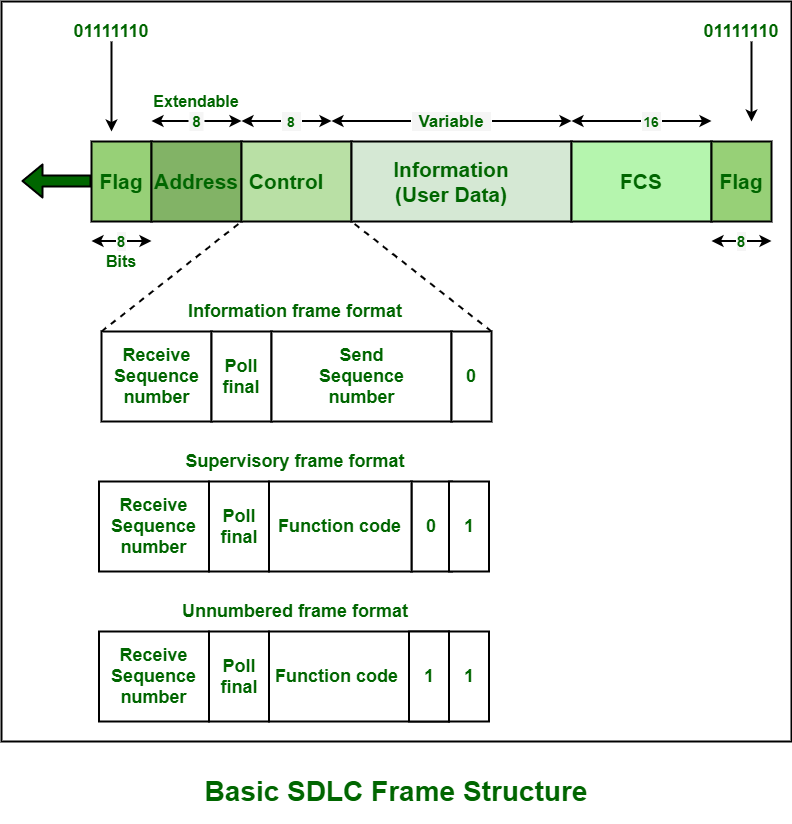

## Estrutura do Quadro de SDLC

**Synchronous Data Link Control (SDLC)** é um protocolo de camada geralmente vinculado que é usado com o ambiente **Systems Network Architecture (SNA)**. SNA é uma arquitetura de rede proprietária da **IBM** desenvolvida em 1974. **SDLC** também suporta uma grande variedade de tipologias e diferentes tipos de links de dados.

Os exemplos incluem enlaces ponto a ponto, enlaces multiponto, redes comutadas, redes de pacotes, etc. Ele também usa o modelo de estação primária-estação secundária de comunicação de dados. Em um link de dados **SDLC** , todas as transmissões de dados e controle são simplesmente organizadas e gerenciadas em um formato específico que é basicamente conhecido como quadro de transmissão. O quadro de transmissão também é conhecido como quadro **SDLC** ou apenas um quadro.

 

 

 

O quadro de transmissão simplesmente transporta ou transfere informações de controle e dados do usuário entre a estação transmissora ou emissora e a estação receptora. Ele permite e dá permissão à estação receptora:

 

 - Para determinar o início e o fim do quadro.
 - Para identificar se o quadro é feito ou destinado a essa estação específica.
 - Para identificar ações que precisam ser executadas com as informações ou dados recebidos.
 - Detectar e identificar erros ocorridos durante a transmissão nos quadros recebidos.
 - Para confirmar o recebimento de seus quadros para a estação transmissora.

### Formato do Quadro

O quadro de transmissão de cada **SDLC** possui um formato de quadro específico. Cada quadro é composto pelos seguintes campos:

 

 

1. **Campo de sinalizador:** O sinalizador **(F)** é o quadro inicial que representa o início do quadro. Este campo é usado para iniciar e encerrar a ocorrência de erro por meio de verificação regular.

 

2. **Campo de Endereço:** O endereço **(A)** arquivado segue logo após o início da bandeira. É usado para identificar e determinar a estação secundária que está transmitindo o quadro. Isso é feito porque o quadro contém informações ou dados relativos ao endereço do grupo, endereço específico. Endereço de transmissão, etc.

3. **Campo de controle:** O campo de controle **(C)** segue logo após o campo de endereço. É usado para especificar as funções de um quadro específico.

Este campo pode estar presente em três tipos de formato conforme abaixo:

  - **(eu). Formato não numerado (U):** É necessário executar várias funções, como estabelecer um link de desconexão, relatar alguns erros de procedimento, transferir ou transmitir dados, especialmente quando a localização ou o endereço dos dados na sequência do quadro não precisam ser verificados.

  - **(ii). Formato supervisório (S):** É necessário para executar várias funções, como reconhecer frames recebidos, transmitir condições de pronto ou ocupado, relatar erros de numeração de frames, etc. Este formato não contém nenhum campo de informação.
  
  - **(iii). Formato de informação (I):** É necessário executar várias funções, como transferir dados ou informações, controlar a sequência em que os quadros são necessários para enviar e o número de quadros.

4. **Campo de Informação:** O campo de informação (I) segue logo após o campo de controle. Este campo é um campo opcional que contém principalmente dados de informação. Os dados necessários para serem transmitidos no link de dados estão presentes neste campo.

5. **FCS Field:** O campo Frame Check Sequence (FCS) segue logo após o campo de informações. Este campo permite e concede permissão especialmente às estações receptoras para simplesmente garantir e verificar a precisão da transmissão do quadro. Este campo simplesmente verifica o frame recebido em busca de algum tipo de erro que possa ter ocorrido na conexão do link.

6. **Ending Flag Field:** Este campo indica o final do quadro.