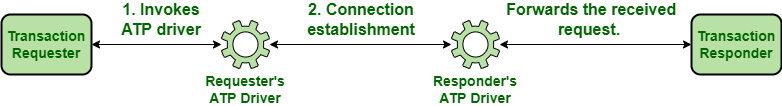
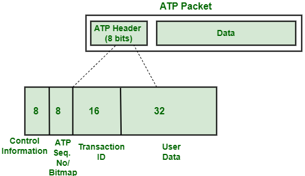

## ATP

**ATP** significa AppleTalk Transaction Protocol. Faz parte de uma série de protocolos de rede chamados 'AppleTalk' desenvolvidos pela [Apple Inc.](https://www.apple.com/) É um protocolo de camada de transporte que permite transferir pequenas quantidades de dados através de uma rede. Ele fornece um meio de comunicação confiável e livre de erros em uma configuração `client-server`. Ele executa a maioria das funções da [**camada de transporte**](../transport/intro.md), como segmentação, sequenciamento de `pacotes`, etc.

O **ATP** funciona em cima de uma arquitetura semelhante a uma arquitetura `client-server`. Há um solicitante que faz uma solicitação para outro terminal chamado respondedor. O respondente executa o necessário e retorna com uma resposta.

 

### Transações no ATP

1. O solicitante invoca a interface ATP. A interface então usa o driver ATP para estabelecer uma conexão dedicada com o driver ATP do respondente.

2. O driver no lado do respondente chama o aplicativo respondente que processa a solicitação recebida e retorna uma resposta para ser enviada de volta ao solicitante.

3. Para enviar a resposta, o respondente invoca sua interface ATP que usa a conexão pré-estabelecida para enviar a resposta de volta ao solicitante.

O diagrama a seguir descreve como ocorre uma transação:

 

 

Para o solicitante, os dados que podem ser transmitidos são de `578 bytes` e para o respondente, o limite é de `4624 bytes`.

### Tipos de transações ATP

Existem dois tipos de transações ATP:

 - **At-Least-Once Transactions:** Em uma transação ALO, é garantido que o respondente receberá todas as solicitações enviadas a ele pelo menos uma vez. Ele não oferece garantia de que a mesma solicitação não será enviada novamente ao respondente.

 - **Transações eXactly-Once:** Em uma transação XO, é garantido que o respondente receberá todas as solicitações enviadas a ele exatamente uma vez. Ele garante que uma solicitação recebida uma vez pelo respondente não será enviada novamente.

A natureza da transação a ser utilizada é determinada pelo tipo de processamento exigido pela solicitação. Se múltiplas execuções de uma mesma requisição forem susceptíveis de causar algum tipo de inconsistência nos resultados obtidos, então as transações XO são utilizadas. Se várias execuções da solicitação provavelmente não causarem problemas, as transações ALO serão usadas.

### Formato do pacote ATP

Um pacote **ATP** consiste em um cabeçalho **ATP** seguido pelos dados. O tamanho do cabeçalho **ATP** é de `8 bytes`. Todo o pacote é armazenado dentro de um datagrama **DDP (Datagram Delivery Protocol)** e é transportado como um quadro da camada de enlace de dados.

A seguir está a estrutura de um pacote **ATP**:

 

 

A parte de dados segue o cabeçalho **ATP**, que pode ter até `578 bytes` ou até `4624 bytes`, dependendo se o pacote está sendo enviado pelo lado do solicitante ou pelo lado do respondente. 

A seguir está uma descrição detalhada dos campos do cabeçalho **ATP**:

 

### Byte de Informação de Controle

Ele é usado para armazenar informações relacionadas ao controle sobre uma solicitação/resposta como o tipo de transação, se este pacote é o último a ser recebido ou não, etc. O byte de informações de controle armazena as seguintes informações

 

| **Nª do Bit** | **Descrição** |
| ------ | ----------- |
| **0** | Especifica se deve usar a soma de verificação **DDP** ou não. |
| **1** | Especifica se o **ID** da transação foi atribuído a esta solicitação ou não |
| **2** | Especifica se esta solicitação usa um bloco de parâmetro estendido ou não |
| **3** | Especifica se o pacote atual deve ser retransmitido imediatamente ou não. |
| **4** | Especifica se este é o último pacote da resposta (fim da mensagem) ou não. |
| **5** |	Especifica se a solicitação atual é uma transação exatamente uma vez ou uma transação pelo menos uma vez (AO).	Especifica se a solicitação atual é uma transação exatamente uma vez ou uma transação pelo menos uma vez (AO). |
 
  

  

 ### Número de bitmap/sequência

  O número de bitmap/sequência tem `8 bits` de tamanho. O **ATP** é conhecido pela confiabilidade que oferece durante a transmissão de dados.

  Ele garante que o solicitante receberá todos os pacotes enviados a ele em resposta à sua solicitação. Para isso, ele precisa rastrear quais pacotes foram recebidos pelo solicitante e quais ainda não foram recebidos. 
  
  A abordagem usada pelo **ATP** para o mesmo é atribuir números de sequência a todos os pacotes que são enviados em resposta e marcar o último pacote de resposta como “fim da mensagem” (indicado pelo bit 4 do byte de informação de controle em ATP cabeçalho). O solicitante reúne todos os pacotes ao recebê-los, verifica o número de sequência e o byte de informação de controle do cabeçalho ATP e determina se recebeu todos os pacotes ou não.

 

### ID da transação

O **ID** da transação é usado para associar cada solicitação à sua resposta correspondente. Tem 16 bits de tamanho. O solicitante pode fazer várias solicitações a qualquer momento. O ID da transação ajuda o ATP a acompanhar todas as solicitações feitas e a garantir que a resposta entregue para cada solicitação esteja correta. É transportado pelo 3º e 4º byte do cabeçalho **ATP**.

 

### Dados do usuário

Os últimos `4 bytes` do cabeçalho **ATP** não são usados ​​pelo ATP. Eles são reservados para uso pelos aplicativos solicitante e respondente. O driver **ATP** oferece suporte a funções predefinidas que permitem definir os valores desses cabeçalhos para o que você deseja.

A tabela a seguir resume os campos que fazem parte do cabeçalho ATP:

 

| **Nª do Bit** | **Armazenado**  |  **Tamanho**   | **Descrição** |
| ------------- | --------------- | -------------- | --------------|
| **1** | Informações de controle |     8     | É usado para armazenar informações relacionadas ao controle sobre uma solicitação/resposta como o tipo de transação, se este pacote é o último a ser recebido ou não, etc.  |
| **2** | Bitmap de Transação/Número de Sequência **ATP** |  8 | É usado para encontrar o número de sequência do pacote atual se o pacote foi enviado em resposta a uma solicitação (chamado número de sequência ATP). Caso o pacote atual seja uma requisição, ele representa o número de buffers suportados pela aplicação (chamado Transaction Bitmap)|
| **3-4** | ID da transação | 16 | Ele armazena o ID da transação de cada solicitação. Ele é usado pelo respondente para acompanhar todas as solicitações |
| **5-8** | Dados do usuário | 32 |  	Carrega informações específicas do aplicativo, como soma de verificação, etc. |