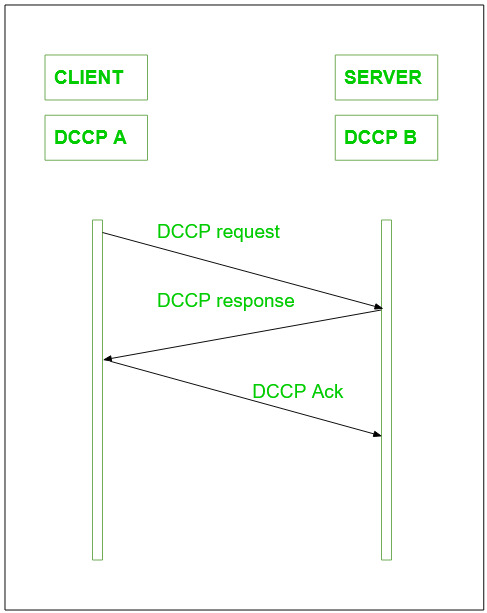
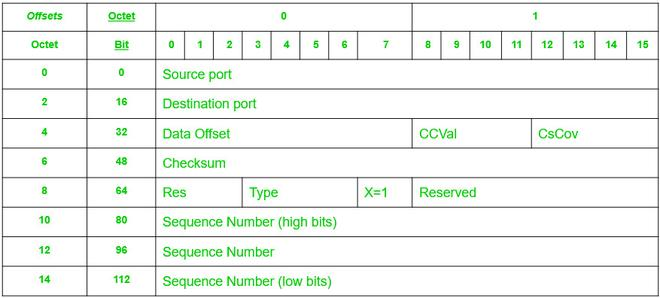
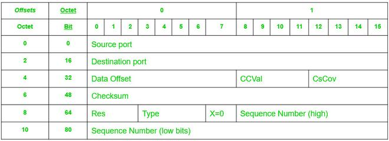

##  DCCP

O congestionamento em uma rede significa a deterioração da rede ou dos serviços que são causados ​​devido à sobrecarga dos nós da rede, basicamente, esse problema está associado principalmente a grandes redes, nas quais uma grande quantidade de dados e informações está sendo transmitida. 

O congestionamento pode ser causado por vários motivos: ou os roteadores que estão sendo usados ​​não são rápidos o suficiente, as **CPUs** que estão sendo usadas não são rápidas o suficiente e não conseguem sair das filas no sistema operacional em tempo hábil, os `buffers` não são grandes o suficiente conforme nossos requisitos ou eles serão perdidos dos pacotes. Também no caso de tráfego muito alto, a situação pode ser pior o suficiente para que nenhum pacote seja entregue.

**DCCP** é basicamente um protocolo de nível de *transporte* baseado em mensagem. A configuração de uma conexão segura é facilmente mantida usando-a, seu fechamento, ou seja, **ECN(Notificação explícita de congestionamento)**, controle de congestionamento e negociação de recursos. O **DCCP** é uma ótima técnica para acessar mecanismos de controle de congestionamento, também não precisamos implementá-los no nível do aplicativo.

Basicamente, o **DCCP** também permite alimentações de protocolo de controle de transferência semelhantes, mas a entrega na ordem de transmissão não pode ser feita. A entrega sequencial de múltiplos fluxos como no  [SCTP- (Stream Control Transmission Protocol)](../transport/sctp.md) não está disponível no DCCP.

O **DCCP** é amplamente utilizado em aplicações de entrega de pacotes composta por restrições de tempo. Os exemplos que se enquadram nesta* categoria incluem jogos multijogador online*, telefonia pela Internet, streaming de mídia **(vídeo, áudio)**, etc. A característica mais importante desses aplicativos é que as mensagens antigas expiram rapidamente e automaticamente, perdendo sua utilidade por padrão.

A configuração da conexão **DCCP** pode ser explicada através da imagem abaixo, é basicamente semelhante à configuração da conexão **TCP**:

 

 

Por outro lado, a maior prioridade é dada às novas mensagens, portanto, reenviar os pacotes não é muito útil aqui, pois acabaria consumindo tempo e recursos de rede desnecessários também. Datagram Congestion Control Protocol também pode ser usado como uma técnica geral de controle de congestionamento para aqueles tipos de aplicativos que também são baseados no **protocolo UDP**. Um mecanismo de segurança também pode ser adicionado e possivelmente um para entrega de pacotes na ordem de transmissão. Em outros casos, o **DCCP** ajuda a usar vários mecanismos de controle de congestionamento, geralmente compatíveis com o **Transmission Control Protocol**. O tráfego de confirmação e o tráfego de dados estão contidos em uma conexão **DCCP**.

O transmissor fica sabendo com a ajuda de confirmações que seus pacotes chegaram ao destino ou foram marcados pelo ECN. As confirmações são utilizadas com a finalidade de segurança exigida pelo mecanismo de controle de congestionamento. Seu principal objetivo é atingir 100% de segurança.

 

### Estrutura do pacote DCCP

O cabeçalho genérico **DCCP** tem várias formas de acordo com o valor dado a `X`, ou seja, o `bit` Extended Sequence Numbers. 

`Seja X = 1, `

o campo Sequence Number tem `48 bits` e o cabeçalho genérico leva `16 bytes`, o que é claramente explicado na imagem abaixo:

 

 

> #### DCCP Structure!
>
> - Cabeçalho genérico DCCP quando X=1

 

Se mudarmos o valor de `X = 0`, apenas os `24 bits` baixos do Número de Sequência são transmitidos e o cabeçalho genérico tem `12 bytes` de comprimento, conforme mostrado na imagem abaixo:

 

 

### Características:

1. **DCCP** é um fluxo de datagrama não confiável, com um bom recurso de confirmação.

2. O **DCCP** ajuda a garantir a negociação de opções, incluindo a negociação do mecanismo mais adequado para controle de congestionamento.

3. Ele fornece um protocolo de handshake seguro com a finalidade de inicializar e fechar a conexão do DCCP.

4. Desempenha um papel vital na descoberta da unidade transmissora máxima no caminho escolhido pelo usuário.

5. Ele fornece técnicas que permitem que os servidores evitem armazenar estados para tentativas de desconexões não conectadas e não confirmadas ou também para conexões já fechadas.

6. Os mecanismos de confirmação são um recurso muito bom do **DCCP**, que ajuda a comunicar a perda de pacotes e as informações **ECN**.

7. Mecanismos opcionais também são algumas boas técnicas que comunicam ao aplicativo emissor com alta segurança, quais pacotes chegaram ao receptor e quais não, também se foram marcados por ECN ou não, ou se estão corrompidos ou removidos do buffer do receptor.

8. O **DCCP** pode suportar vários fluxos simultâneos em uma única conexão, o que permite que os aplicativos transmitam vários fluxos de dados na mesma conexão.

9. Ele fornece um mecanismo para que os aplicativos priorizem seus fluxos de dados, o que ajuda a obter melhor qualidade de serviço (**QoS**).

10. O DCCP suporta modos de comunicação orientados a conexão e sem conexão.

11. Ele oferece um mecanismo de controle de congestionamento mais flexível do que o mecanismo de controle de congestionamento do [TCP](../transport/tcp.md).

12. O **DCCP** pode ser usado em redes **IP v4** e **IP v6**.

 

### Vantagens 
  
  - **Controle de congestionamento:** Ao contrário do **UDP**, que não possui nenhum mecanismo integrado para controlar o congestionamento, o **DCCP** inclui algoritmos de controle de congestionamento que ajudam a evitar a sobrecarga da rede e garantir a entrega confiável de dados.

  - **Suporte de qualidade de serviço (QoS):** **DCCP** fornece suporte para QoS, o que permite aos administradores de rede priorizar diferentes tipos de tráfego com base em sua importância. Isso pode ser útil para aplicações como `streaming de vídeo ou voz sobre IP`, onde baixa latência e alta confiabilidade são essenciais.

  - **Flexibilidade:** O **DCCP** foi projetado para ser um protocolo flexível, permitindo que os administradores de rede escolham entre uma variedade de algoritmos de controle de congestionamento com base nos requisitos específicos de sua rede e aplicativos.

  - **Compatibilidade:** DCCP é projetado para funcionar com redes **IP** existentes e é compatível com protocolos **IP** tradicionais como **TCP** e **UDP**.

 

### Aplicações do mundo real

- **Streaming de mídia:** DCCP é frequentemente usado em aplicativos de streaming de mídia, como videoconferência, onde baixa latência e alta confiabilidade são importantes. Os algoritmos de controle de congestionamento incorporados ao DCCP ajudam a garantir que esses aplicativos possam ser executados de maneira suave e eficaz, mesmo em redes com altos níveis de congestionamento.

- **Jogos:** alguns aplicativos de jogos online também usam DCCP, pois seus algoritmos de controle de congestionamento podem ajudar a evitar lentidão da rede e garantir que os dados do jogo sejam entregues de forma rápida e confiável.

- **Telemetria:** DCCP também é usado em aplicações de telemetria, onde grandes quantidades de dados precisam ser transmitidas de dispositivos remotos de volta para um centro de controle central. Os algoritmos de controle de congestionamento incorporados ao DCCP ajudam a garantir que esses dados sejam entregues de maneira confiável e eficiente, mesmo em redes congestionadas.

- **Acesso remoto:** DCCP pode ser usado para aplicações de acesso remoto, pois fornece uma conexão confiável e segura para acesso remoto a servidores e outros recursos.