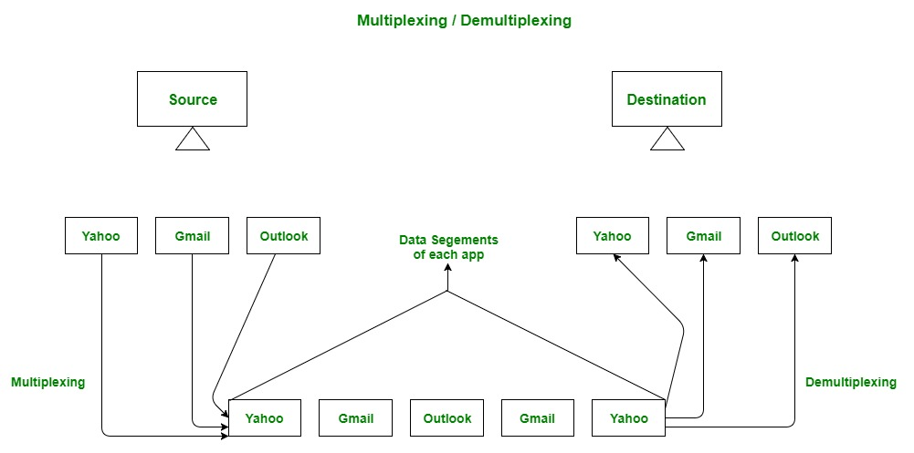
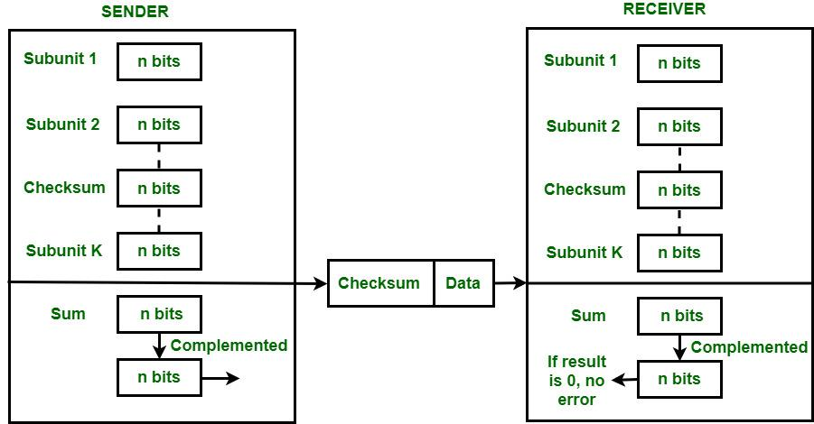

## Camada de Transporte

A camada de transporte é a segunda camada no modelo TCP/IP e a quarta camada no modelo OSI. É uma camada de ponta a ponta usada para entregar mensagens a um host. É denominada camada ponta a ponta porque fornece uma conexão ponto a ponto, em vez de salto a salto, entre o host de origem e o host de destino para fornecer os serviços de maneira confiável. A unidade de encapsulamento de dados na Camada de Transporte é um segmento. 

 

### Funcionamento da Camada de Transporte

A camada de transporte recebe serviços da camada de Aplicação e fornece serviços para a camada de Rede.

**Do lado do remetente:** A camada de transporte recebe dados (mensagem) da camada de Aplicação e então realiza a Segmentação, divide a mensagem real em segmentos, adiciona os números das portas de origem e destino no cabeçalho do segmento e transfere a mensagem para a Rede camada. 

**Do lado do receptor:** A camada de transporte recebe dados da camada de Rede, remonta os dados segmentados, lê seu cabeçalho, identifica o número da porta e encaminha a mensagem para a porta apropriada na camada de Aplicação.

 

### Responsabilidades de uma camada de transporte

- O processo para processar a entrega
- Conexão ponta a ponta entre hosts
- Multiplexação e Demultiplexação
- Controle de congestão
- Integridade de dados e correção de erros
- Controle de fluxo

1. **O processo para processar a entrega**

  Enquanto a camada de enlace de dados requer o endereço **MAC** (endereço de 48 bits contido na placa de interface de rede de cada máquina host) dos hosts de origem-destino para entregar um quadro corretamente e a camada de rede requer o endereço IP para roteamento apropriado de pacotes, de maneira semelhante A camada de transporte requer um número de porta para entregar corretamente os segmentos de dados ao processo correto entre os vários processos em execução em um determinado host. Um número de porta é um endereço de `16 bits` usado para identificar exclusivamente qualquer programa client-server.

2. **Conexão ponta a ponta entre hosts**
  
  A camada de transporte também é responsável por criar a conexão ponta a ponta entre os hosts para os quais usa principalmente **TCP** e **UDP**. O **TCP** é um protocolo seguro orientado à conexão que usa um protocolo de handshake para estabelecer uma conexão robusta entre dois hosts finais. O **TCP** garante a entrega confiável de mensagens e é usado em várias aplicações. O UDP, por outro lado, é um protocolo sem estado e não confiável que garante a entrega com o melhor esforço. É adequado para aplicações que têm pouca preocupação com fluxo ou controle de erros e requerem o envio da maior parte dos dados, como videoconferência. É freqüentemente usado em protocolos multicasting.

3. **Multiplexação e Demultiplexação**
   
  Multiplexação (muitos para um) é quando os dados são adquiridos de vários processos do remetente e mesclados em um pacote junto com cabeçalhos e enviados como um único pacote. A multiplexação permite o uso simultâneo de diferentes processos em uma rede que está sendo executada em um host. Os processos são diferenciados por seus números de porta. Da mesma forma, a demultiplexação (um para muitos é necessária no lado do receptor quando a mensagem é distribuída em diferentes processos. O transporte recebe os segmentos de dados da camada de rede, distribui e os entrega ao processo apropriado em execução na máquina do receptor.)

   

  

   

4. **Controle de congestionamento**

  O congestionamento é uma situação em que muitas fontes em uma rede tentam enviar dados e os `buffers` do roteador começam a transbordar devido à perda de pacotes. Como resultado, a retransmissão de pacotes das fontes aumenta ainda mais o congestionamento. Nesta situação, a **camada de Transporte** fornece Controle de Congestionamento de diferentes maneiras. Ele usa controle de congestionamento em malha aberta para evitar congestionamentos e controle de congestionamento em malha fechada para remover o congestionamento em uma rede uma vez ocorrido. **TCP** fornece **AIMD – additive increases multiplicative decrease** e técnica de **leaky bucket** para controle de congestionamento.

5. **Integridade dos dados e correção de erros**

  A **camada de transporte** verifica se há erros nas mensagens vindas da camada de aplicação usando códigos de detecção de erros e calculando somas de verificação, verifica se os dados recebidos não estão corrompidos e usa os serviços ACK e NACK para informar ao remetente se os dados chegaram ou não e verifica a integridade dos dados.

   

  

   

  6. **Controle de Fluxo**
   
  A camada de transporte fornece um mecanismo de controle de fluxo entre as camadas adjacentes do modelo **TCP/IP**. O **TCP** também evita a perda de dados devido a um remetente rápido e um destinatário lento, impondo algumas técnicas de controle de fluxo. Utiliza o método do protocolo de janela deslizante que é realizado pelo receptor enviando uma janela de volta ao remetente informando o tamanho dos dados que ele pode receber.

   

  ### Protocolos da Camada de Transporte

   - [Protocolo de Controle de Transmissão (TCP)](../transport/tcp.md)
   - [Protocolo de datagrama de usuário (UDP)](../transport/udp.md)
   - [Protocolo de transmissão de controle de fluxo (SCTP)](../transport/sctp.md)
   - [Datagram Congestion Control Protocol (DCCP)](../transport/dccp.md)
   - [Protocolo de transação AppleTalk (ATP)](../transport/atp.md)
   - [Protocolo Fibre Channel (FCP)](../transport/fcp.md)
   - [Protocolo de dados confiáveis ​​(RDP)](../transport/rdp.md)
   - [Protocolo de dados de usuário confiável (RUDP)](../transport/rudp.md)
   - [Transporte Estruturado de Vapor (SST)](../transport/sst.md)
   - [Troca de pacotes sequenciados (SPX)](../transport/spx.md)