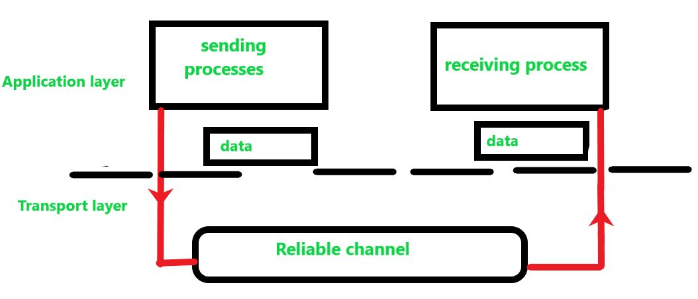
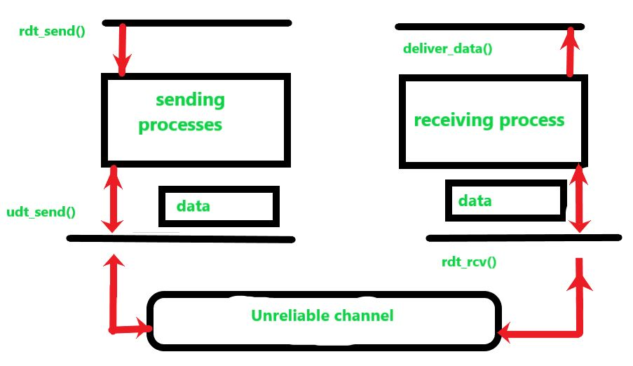

## RDP

Os protocolos da camada de transporte são peças centrais de arquiteturas em camadas, fornecem a comunicação lógica entre os processos de aplicativos. Esses processos usam a comunicação lógica para transferir dados da camada de transporte para a camada de rede e essa transferência de dados deve ser confiável e segura. Os dados são transferidos na forma de pacotes, mas o problema ocorre na transferência confiável de dados.

O problema de transferência de dados ocorre não apenas na camada de transporte, mas também na camada de aplicação e também na camada de enlace. Este problema ocorre quando um serviço confiável é executado em um serviço não confiável, por exemplo, **TCP (Transmission Control Protocol)** é um protocolo de transferência de dados confiável que é implementado no topo de uma camada não confiável, ou seja, o **Internet Protocol (IP)** é um fim a fim protocolo da camada de rede.

Projetamos os lados **emissor** e **receptor** de um protocolo em um canal confiável. Na transferência confiável de dados a camada recebe os dados da camada acima quebra a mensagem na forma de segmento e coloca o cabeçalho em cada segmento e transfere. A camada abaixo recebe os segmentos e remove o cabeçalho de cada segmento e torna-o um pacote adicionando ao cabeçalho:

 

 

Neste modelo, projetamos os lados emissor e receptor de um protocolo em um canal confiável. Na transferência confiável de dados a camada recebe os dados da camada acima quebra a mensagem na forma de segmento e coloca o cabeçalho em cada segmento e transfere. A camada abaixo recebe os segmentos e remove o cabeçalho de cada segmento e torna-o um pacote adicionando ao cabeçalho.

Os dados que são transferidos de cima não têm bits de dados corrompidos ou perdidos, e todos são entregues na mesma sequência em que foram enviados para a camada abaixo, este é um protocolo de transferência de dados confiável. Este modelo de serviço é oferecido pelo TCP para as aplicações de Internet que invocam esta transferência de dados.

 

 

Da mesma forma, em um canal não confiável, projetamos o lado de envio e recebimento. O lado de envio do protocolo é chamado da camada acima para **rdt_send()** então ele passará os dados que devem ser entregues à camada de aplicativo no lado de recebimento (aqui **rdt-send()** é uma função para enviar dados onde **rdt** significa protocolo de transferência de dados confiável e **_send()** é usado para o lado de envio).

No lado receptor, `rdt_rcv()` (`rdt_rcv()` é uma função para receber dados onde -rcv() é usado para o lado receptor), será chamado quando um pacote chegar do lado receptor do canal não confiável. Quando o protocolo rdt deseja entregar dados para a camada de aplicação, ele o fará chamando `delivery_data()` (onde `delivery_data()` é uma função para entregar dados para a camada superior).

No protocolo de transferência de dados confiável, consideramos apenas o caso de transferência de dados unidirecional, ou seja, a transferência de dados do lado de envio para o lado de recebimento (ou seja, apenas em uma direção). No caso de bidirecional (`full duplex` ou transferência de dados em ambos os lados), a transferência de dados é conceitualmente mais difícil. Embora consideremos apenas a transferência de dados unidirecional, é importante observar que os lados de envio e recebimento de nosso protocolo precisarão transmitir pacotes em ambas as direções, conforme mostrado na figura acima.

Para trocar pacotes contendo os dados que precisam ser transferidos, ambos os lados (enviando e recebendo) do rdt também precisam trocar pacotes de controle em ambas as direções ou seja, para frente e para trás, ambos os lados do rdt enviam pacotes para o outro lado por uma chamada para udt_send() udt_send() é uma função usada para enviar dados para o outro lado onde udt significa protocolo de transferência de dados não confiável.