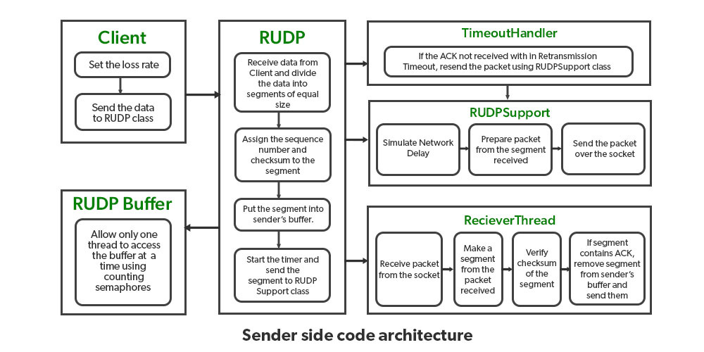
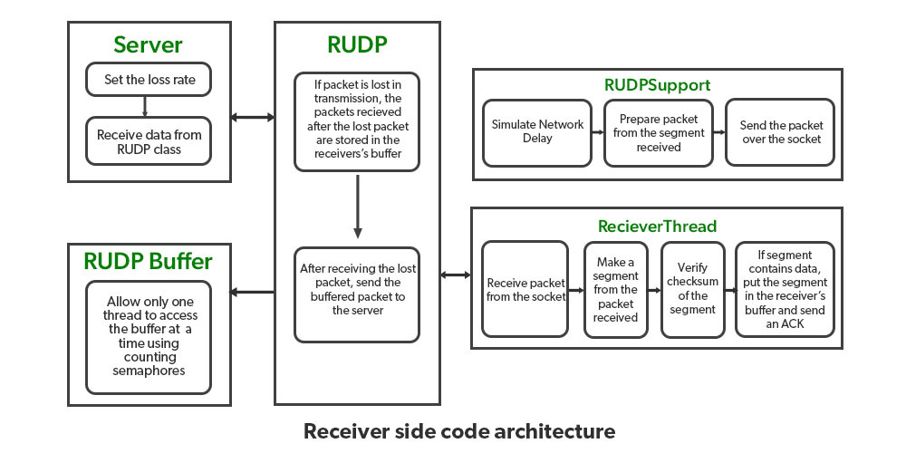

## Reliable User Datagram Protocol RUDP

**RUDP** significa protocolo de datagrama de usuário confiável, enquanto **UDP** é um dos principais membros do **IP**, ou seja, conjunto de protocolos da Internet. O **UDP** é usado como um protocolo comunicativo altamente sensível ao tempo. `R` em **RUDP** significa confiável, é uma transferência de dados baseada em **UDP**, mas com maior confiabilidade. Ele fornece confiabilidade usando o protocolo de janela deslizante. O **RUDP** é basicamente a solução para o [UDP](../transport/udp.md), onde a confiabilidade dos dados e a confirmação são necessárias.

Como o [UDP](../transport/udp.md) fornece um protocolo de transferência de dados não confiável, que é um serviço não confiável e, o pior, às vezes desaparece sem aviso prévio. O **UDP** confiável usa feedback positivo e negativo para fornecer confiabilidade de dados que fornece transferência de dados confiável.

No remetente [UDP](../transport/udp.md) basta enviar uma mensagem sem uma informação prévia sobre a disponibilidade do destinatário o que resulta em uma taxa mais rápida mas pode resultar na perda de alguns pacotes, também o destinatário pode receber pacotes duplicados e o UDP também não fornece informações que o pacote foi recebido ou não. O **RUDP** usou um protocolo de janela deslizante que entrega ou transfere o datagrama com confiabilidade.

### Arquitetura RUDP

O processo de envio e o processo de recebimento da arquitetura estão ambos na camada de aplicação. O servidor remetente envia os pacotes de dados para o canal receptor usando o protocolo RUDP; um tamanho de janela é mantido tanto pelo remetente quanto pelo destinatário, a janela consiste em algum valor predefinido tendendo ao máximo, evitando os erros de comunicação, levando em consideração todos os casos extremos em que os pacotes podem ser descartados. 

<br>

### Implementação do protocolo RUDP

Use `buffers` compartilhados sincronizados usando semáforos de contagem para que apenas um thread acesse o `buffer` por vez para evitar que a situação de impasse ocorra. 

Vamos manter duas variáveis ​​chamadas como base e a seguir para acompanhar o funcionamento da janela. Se o remetente enviou o pacote, a variável next é incrementada para 1, esta é a forma de calcular o número de pacotes no buffer.

Os tempos limite são tratados usando os temporizadores que são programados imediatamente após o envio do pacote pelo canal, simulam a taxa de perda de pacotes e o atraso aleatório da rede no protocolo.

os pacotes são mantidos em uma fila e recebem um valor que valoriza a hora atual do sistema mais o atraso da rede. Quando a hora atual do sistema é associada ao valor atribuído, o pacote é liberado da fila e enviado pela rede. Enquanto o pacote é enviado pela rede, ele dá uma confirmação **(ACK).** Quando o **ACK** coincide com o número de sequência, os remetentes enviam outro pacote atribuindo-o ao número consecutivo.


<br>

### Classes no protocolo RUDP

A seguir estão as classes que são usadas para implementar o protocolo **RUDP**:

- **RUDP:** Contém as funções send() e receive() chamadas pelo cliente e servidor.
- **Buffer_RUDP:** contém o buffer compartilhado de implementação usando semáforos de contagem.
- **Receiver_Thread:** Implementa uma arquitetura encadeada que espera simultaneamente pelos pacotes nos soquetes enquanto envia e recebe os dados e espera para processar os dados recebidos.
 - **Segment_RUDP:** define a estrutura dos pacotes RUDP.
 - **Timeout_Handler:** para lidar com os tempos limite
 - **Support_RUDP:** fornece funções como send_UDP();
 - **Cliente:** Envia os dados.
 - **Servidor:** Recebe os dados.

<br>

### Protocolo de janela deslizante

O protocolo de janela deslizante, também conhecido como **RUDP's** **SWP**, no qual o **RUDP** se baseia, é usado onde a confiabilidade entra em jogo e é muito essencial ou por razões de segurança, onde é necessário o conhecimento dos dados transferidos junto com a confirmação. Funciona em segmentos, o que significa que divide os dados fornecidos em segmentos, em seguida, pacotes ou pacotes de dados são preparados e enviados pela rede, resultando em quando o receptor recebe o pacote, verifica a ordem dos pacotes e descarta duplicados e, depois disso, é enviado ele envia a confirmação ao remetente para os pacotes recebidos corretamente.

<br>

Existem 3 protocolos de janela deslizante:

 1. Protocolo de janela deslizante de um `bit`
 2. Voltar para o protocolo `N`
 3. Protocolo de Repetição Seletiva

<br>

### Técnica de Piggyback

O protocolo de janela deslizante usa a técnica de **piggy-backing**, a técnica é baseada na confirmação recebida, mas, como é recebida? Portanto, a resposta é que ele fornece o protocolo de janela deslizante para anexar a confirmação no próximo quadro, de modo que, quando um receptor receber os dados, mantenha um conjunto de números de sequência correspondentes aos quadros que também podem ser chamados de quadros de confirmação dentro de um parte da janela de tamanhos iguais ou diferentes.

<br>

### A matemática do cálculo do quadro

Quando um novo pacote é enviado pelo remetente ao destinatário, ele recebe a marca de sequência de pacote mais alta e a borda superior da janela é incrementada com um para os quadros confirmados e vice-versa para os quadros não confirmados. Isso calcula a marca dos quadros não confirmados, bem como dos quadros confirmados e, quando esse número chega a zero, significa que todos os pacotes foram entregues com sucesso e fornece feedback ao remetente. Ele é usado em aplicativos com uso intensivo de dados que exigem muito trabalho em muito menos tempo em redes de alta velocidade, onde a confiabilidade desempenha um papel muito importante.

<br>

### Arquitetura de código do lado do servidor

<br>

 - Client Class define a taxa de perda e envia os dados para a classe **RUDP**, onde os tamanhos de janela do remetente e do destinatário são definidos na classe.

 - A classe **RUDP** de acordo com o trabalho divide os dados em segmentos de tamanhos iguais e, portanto, atribui os quadros, ou seja, número de sequência e soma de verificação a cada segmento separadamente e, em seguida, coloca-os na janela do remetente se houver algum slot disponível.

 - Support_RUDP entra em jogo agora, quando os pacotes de dados em segmentos são enviados pelo remetente, esta classe coleta e prepara os pacotes dos segmentos e os envia pelo canal não confiável. Uma vez enviado, o cronômetro é ativado imediatamente.

 - A classe Thread_receiver é a classe importante para a estrutura **RUDP** ela fornece uma thread junto com a thread dos dados ela envia paralelamente uma thread com os dados e espera no socket pelos dados que chegam, quando recebe o pacote do socket faz um segmenta e verifica a soma de verificação, se a soma de verificação esclarecer que são os dados enviados, ele verifica a confirmação se a confirmação foi recebida, remove o pacote da janela do remetente e o envia pelo soquete; se ocorrer um timeout e um pacote for perdido, ele reenvia o pacote e reinicia o timer imediatamente. Se a classe **RUDP** receber o pacote antes do timeout, ele cancela o timer.

<br>



<br>

### Arquitetura do Código do Lado do Receptor


- `Thread_receiver` A classe que implementou uma thread paralela corre com a thread dos dados enviados e uma das instâncias espera no socket para continuar processando os dados que estão chegando. 

- Assim que a classe recebe o pacote é verificado com o segmento e faz um segmento dele e combina com o checksum. Se o segmento contiver os dados necessários, ele enviará uma confirmação e o colocará na classe `Buffer_receiver` e, se o pacote não estiver lá, ele armazenará todos os seguintes perdidos no `Buffer_receiver`.

- Assim que o pacote perdido é recebido, ele processa tudo e, em seguida, a classe **RUDP** entrega todos os pacotes, reordenando corretamente, uma vez que foi armazenado em `buffer` no servidor.
Uma vez fornecida a confirmação de que todos os dados foram recebidos, a conexão é encerrada.

<br>



<br>

### Pseudocódigo para classe RUDP

<br>

```
Class RUDP{
//setting up the window sizes
set Receiver Window size
set Sender Window size
start receiver thread that receives the aka(Acknowledgment) and data for both the receiver and the sender
//sender calls
sent_data(byte[] data_gram, int size)
{
     //process flow => data -> segments -> store into sender buffer -> send -> start timer
     //breaking into segments and sending along with frames
     Divide into the segments.
     put every segment into the sender's buffer
     segment sending using sent_udp() of support_RUDP class
     timeout scheduling for the data that is divided into segments using frames
}
//receiver calls
receive_data(byte[] buffer, int size)
{
     //receiving of the segments of the data packets
     segment receiving once at a time including the frames
}
//call by both the sender and receiver
close()
{
     //creation of flag for the indication
     creation of a flag segment to indicate the data transfer status
     //verification of the data
     //if data receiving completed -> close
     once the complete data is received close the segment
}
}
//RUDP class ends here
```

<br>

### Pseudocódigo da classe `Thread_receiver`

```
Class Thread_receiver  { 
  while(true) { 
    //aguardando o pacote -> recebido 
    Recebe o pacote do socket 
    //numeriza ou faz checksum dos dados 
    individualiza um segmento do pacote que é recebido 
    //verificação do 
    checksum dos dados verificação que é enviado ao longo dos quadros 
    se o segmento contiver 
    processo de confirmação -> remover segmentos do buffer do remetente 
    se o segmento contiver dados 
    inserir dados->buffer do receptor 
    enviar confirmação 
    } 
} 

```
<br>

```
Class Support_RUDP 
{ 
    //simular sobre as condições que podem fazer com que os segmentos não sejam recebidos 
    atraso de rede completamente aleatório 
    perda de rede 
    qualquer outro potencial que possa afetar o pacote 
    //processar 
    pacotes dos segmentos recebidos processando 
    //enviar 
    pacote de dados enviado pelo soquete 
} 
//fim da classe Support_RUDP Pseudocódigo para classe cliente-servidor 
//Classe remetente 
Cliente{ 
    RUDP rudp = new RUDP(Host_name, Port, Local); 
    //envia os dados 
    rudp.send(); 
    //fecha 
    rudp.close(); 
} 
//fim da classe cliente


//Receiver Class start 
Class Server{ 
    RUDP rudp = new RUDP(Host_name, Port, Local); 
    //recebe os dados 
    rudp.receive(); 
    //fecha 
    rudp.close(); 
}
```