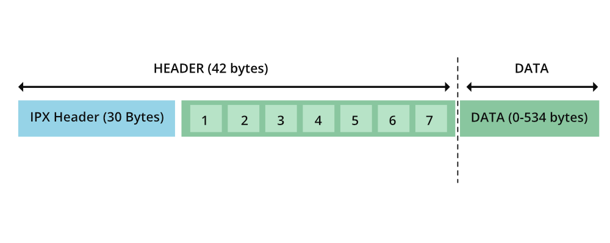

## SPC (Sequenced Packet Exchange)

NetWare, desenvolvido pela Novell é um NOS que se expande para sistemas operacionais de rede. O NOS é um tipo especial de sistema operacional que ajuda os computadores pessoais em uma rede (por exemplo: computadores conectados em LAN) a compartilhar arquivos e recursos como impressoras. Eles fazem com que os PCs conectados em rede atuem em uma arquitetura cliente-servidor. O IPX/SPX é o protocolo usado no sistema operacional NetWare. 

O protocolo IPX corresponde à camada de rede e o protocolo SPX acima dela corresponde à camada de transporte no modelo OSI. O IPX/SPX é semelhante ao TCP/IP onde o IPX assume o papel do IP e o SPX assume o papel do TCP.

 

### Protocolo SPX

O **protocolo SPX** foi desenvolvido pela Novell para redes locais. Ele se expande para Sequenced Packet Exchange e é orientado à conexão. Permite a troca de informações entre os clientes e o servidor em rede com o auxílio do protocolo **IPX**. O protocolo **IPX/SPX** é derivado do **SPP (Sequenced Packet Protocol)** que foi definido nos Sistemas de Rede Xerox. O SPP é um protocolo sem conexão, enquanto o SPX é orientado à conexão.

 

### Estrutura dos pacotes SPX

 

 

O pacote de dados **SPX** contém um cabeçalho de `42 bytes` e os dados podem variar de 0 a `534 bytes`. O comprimento mínimo é de `42 bytes`, ou seja, sem nenhum dado. Os primeiros `30 bytes` são retirados do cabeçalho IPX e o restante dos `12 bytes` são novos sete campos (mencionados como 1…7 no diagrama acima) pertencentes ao **SPX**.

Os campos considerados do cabeçalho **IPX** são os seguintes:

 

#### soma de verificação

As somas de verificação são necessárias para manter a integridade dos dados trocados. A origem e os destinos derivam as somas de verificação em alguns métodos. A origem o anexa ao cabeçalho e o envia ao destino. Por outro lado, o destino compara o checksum calculado por ele com o do cabeçalho do pacote. Se houver uma incompatibilidade, os dados serão considerados corrompidos. Geralmente, somas de verificação de 16 bits são usadas em protocolos de rede. O IPX também usa 2 bytes para soma de verificação no cabeçalho. Se o valor hexadecimal de FFFF for definido, a soma de verificação não será usada.

 

#### Comprimento

Isso denota o comprimento total (cabeçalho + dados) do pacote trocado. Consome 2 bytes .

 

#### Controle de transporte

Este é um campo de 1 byte usado para contar o número de roteadores pelos quais o pacote passou. A partir do valor 0, cada roteador que recebe o pacote adiciona '1' a este campo. Quando o pacote passar por 15 roteadores, o 16º roteador descartará o pacote.

 

#### Tipo de pacote

Isso é usado para saber qual serviço o pacote presta. Também leva apenas 1 byte . Dependendo do valor deste byte, qualquer um dos seguintes pode ser o tipo de pacote:

 

- 0 – Desconhecido
- 1 – Protocolo de Informação de Roteamento
- 2 – Pacote de eco
- 3 – Pacote de erro
- 4 – Protocolo de Troca de Pacotes
- 5 – Protocolo de Pacote Seqüenciado
- 17 - Protocolo Núcleo NetWare

 

#### Endereço de Origem

O endereço da origem do pacote é mencionado na estrutura de endereçamento **IPX**. Leva `12 bytes`.

 

#### Endereço de Destino

O endereço do aplicativo de destino para o qual o pacote deve ser entregue. Deve seguir a estrutura de endereçamento **IPX**. Para enviar dados para todos os computadores da rede `FF:FF:FF:FF:FF: FF` deve ser especificado no destino. Leva `12 bytes`.

 

#### Estrutura de endereçamento IPX

A estrutura de endereçamento **IPX** contém três campos:

1. Network
2. Node
3. Socket

A rede é usada para especificar um número de rede na comunicação entre redes. A comunicação entre redes permite a troca de dados entre os nós presentes em diferentes conexões de cabo. Se o número da rede for mencionado como `00:00:00:00`, a comunicação está ocorrendo dentro da mesma rede. São necessários `32 bits` para especificar o número de uma rede.

O node é usado para identificar exclusivamente o computador pessoal nessa rede. 

O `socket`  é usado para identificar o aplicativo apropriado no lado de destino ao qual o pacote deve ser entregue.

Assim, 2(checksum) + 2(Length) + 1(Transport control) + 1(Packet type) + 12(Source addr) + 12(Destination Addr) = `30 bytes` do cabeçalho **IPX**. O cabeçalho **IPX** junto com os sete campos seguintes compõem o cabeçalho de um pacote **SPX**.

 

### Os sete novos campos são:

 

1. [Controle de conexão](#connection-controller)
2. [Tipo de fluxo de dados](#flux-data-type)
3. [Código de conexão de origem](#id-connection-origin-destination)
4. [Código de conexão de destino](#id-connection-origin-destination)
5. [Número sequencial](#seq-number)
6. [Confirmar número](#confirmed-number)
7. Número de alocação

 
 

<a name="connection-controller">
  <b>1.</b> Controle de conexão
</a>

 É um campo de `1 byte`, que controla a troca de dados bidirecional. Existem quatro sinalizadores que serão definidos dependendo se o pacote é para um sistema ou um aplicativo individual. As bandeiras são as seguintes:

  - END_OF_MESSAGE
  - ATENÇÃO
  - ACKNOWLEDGEMENT_REQUIRED
  - PACOTE DO SISTEMA

 

<a name="flux-data-type">
  <b>2.</b> Tipo de fluxo de dados
</a>

É um campo de `1 byte` que denota o tipo de dados no pacote. Os valores hexadecimais `0xFE` e `0xFF` são reservados para fins específicos. O valor `0xFE` é usado pelo cliente para indicar que esta é a última mensagem e o pacote entregue é conhecido como pacote de fim de conexão. Se o valor for definido como `0xFF`, então é um pacote de sistema que reconhece o término da conexão e isso é referido como um pacote de confirmação de fim de conexão.

 

<a name="id-connection-origin-destination">
  <b>3-4.</b> Tipo de fluxo de dados
</a>

Referem-se ao número de identificação associado à origem local e ao destino remoto. Cada um ocupa `2 bytes`, portanto, ambos juntos consomem `4 bytes`.

 

<a name="seq-number">
  <b>5.</b> Número de sequência
</a>

Esta é uma contagem gerenciada pelo protocolo **SPX** para indicar o número de pacotes enviados em uma única direção. Isso leva `2 bytes` e o valor máximo que pode atingir é `0xFFFF(65.535)`. Após o valor máximo, ele é redefinido para '0'.

 

<a name="confirmed-number">
  <b>6.</b> Confirme o número
</a>

Isso leva `2 bytes` e indica o número de sequência esperado. Aqui também o valor máximo é `0xFFFF`(**65.535**). Os pacotes duplicados podem ser determinados usando o número de confirmação. Se o número de sequência do novo pacote < número de reconhecimento, então é um pacote duplicado e deve ser descartado.

 

<a name="aloc-number">
  <b>7.</b> Número de alocação
</a>

 

Os pacotes serão enviados até que o número de sequência da fonte local seja igual ao número de alocação do destino remoto. Para controlar o fluxo de dados e saber os `buffers` restantes que estão ouvindo os pacotes **SPX**, a fórmula (número de alocação do destino – número de reconhecimento) pode ser usada. Consome `2 bytes`.

 
 

## Diferença entre TCP/IP e IPX/SPX

 

### TCP/IP

- Esta é a base da Internet.
- É um protocolo sem conexão.
- A lógica de endereçamento é um pouco complexa, pois requer `MAC`, `endereço IP` e técnicas de mascaramento para rotear os dados.
- O número da rede deve ser derivado do endereço **IP**. A máscara de sub-rede será usada para derivação.
- A velocidade é menor em comparação com a pilha **IPX/SPX**.

 

### IPX/SPX 

 - 	Principalmente usado e otimizado para conexões **LAN** e não adequado para a Internet.
 - 	É um protocolo orientado a conexão.
 - 	A lógica de endereçamento é mais simples, pois apenas o endereço `MAC` é usado e é dividido em placas Ethernet e endereços de nó.
 - Os números de rede são separados e não dependem do endereço local dos nós.
- 	Pilha mais rápida em comparação com **TCP/IP**. 