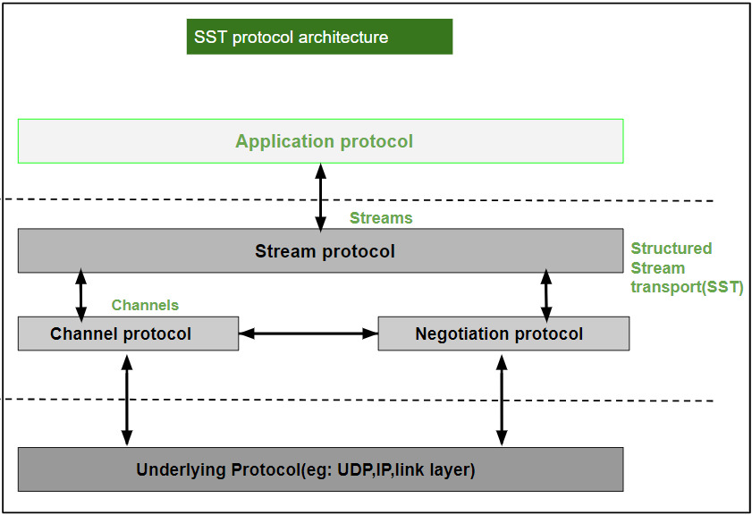

## Structured Steam Transport SST

O transporte de fluxo estruturado é um protocolo de transporte experimental semelhante ao [TCP](../transport/tcp.md) (protocolo de controle de transmissão) que fornece uma abstração organizada e confiável de fluxo de bytes. O **SST** aprimora a estrutura hereditária hierárquica de abstração de fluxo tradicional, que permite que os aplicativos criem fluxos filhos leves a partir de qualquer fluxo existente. Os datagramas que suportam pequenas transações e fluxos são mais adequados para conversas de longa duração, mas nenhum dos dois suporta aplicativos como [HTTP (HyperText Transfer Protocol)](../application/http.md), que é uma mistura de tamanhos de transações e aplicativos ou várias instâncias de transporte (como FTP). Os fluxos [TCP](../transport/tcp.md) suportam atrasos de handshake de 3 vias na inicialização, enquanto os fluxos de tempo de espera no **SST** oferecem transferência de dados independente e controle de fluxo. Todos os fluxos compartilham um contexto de controle de congestionamento.

 

### Arquitetura do protocolo SST

- O protocolo de canal fornece sequenciamento, segurança de conexão e controle de congestionamento.

- O protocolo de negociação fornece mecânica de estabelecimento de canais entre hosts, incluindo acordo de chave simétrica para segurança de canal e negociação de extensão de protocolo opcional.

- O protocolo de registro fornece suporte para um serviço de pesquisa e registro de host simples e opcional. Identificação segura do host e [NAT (transação de acesso à rede)](../application/nat.md).

- O protocolo de fluxo é uma abstração de alto fluxo conveniente baseada nos três protocolos acima para implementar o aplicativo **SST**.

 

 

### Características

 

1. Em uma única sessão **SST**, vários fluxos independentes podem ser executados em paralelo.

2. Prioridade relativa entre fluxos para aplicar políticas específicas do aplicativo.

3. Ele fornece eficiência de fio, incluindo sobrecarga de cabeçalho de **SST**, o encapsulamento UDP é apenas 4 bytes maior que o [TCP](../transport/tcp.md).

4. Ele fornece segurança de comunicação integrada.

5. Ele fornece suporte eficiente para o uso curto de vapores confiáveis.

6. Os fluxos podem ser arbitrariamente longos e podem preservar marcas de registro específicas do aplicativo interno.

7. Suporte de perfuração para comunicação transparente na maioria dos [NATs](../application/nat.md) e [firewalls](../network_security/firewall.md).

 