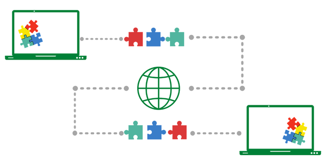

## Protocolo de Controle de Transmissão (TCP)

**TCP (Transmission Control Protocol)** é um dos principais protocolos do conjunto de protocolos da Internet. Encontra-se entre as camadas de aplicativo e rede, que são usadas para fornecer serviços de entrega confiáveis. É um protocolo orientado a conexão para comunicações que ajuda na troca de mensagens entre diferentes dispositivos em uma rede. O Protocolo de Internet (IP), que estabelece a técnica de envio de pacotes de dados entre computadores, funciona com o **TCP**.

 

 

### Funcionamento do TCP

Para garantir que cada mensagem chegue intacta ao seu local de destino, o modelo **TCP/IP** divide os dados em pequenos pacotes e depois os remonta na mensagem original na extremidade oposta. Enviar as informações em pequenos pacotes de informações simplifica a manutenção da eficiência, em vez de enviar tudo de uma vez. 

Depois que uma determinada mensagem é dividida em pacotes, esses pacotes podem viajar por várias rotas se uma rota estiver congestionada, mas o destino permanecer o mesmo.

Podemos ver que a mensagem está sendo dividida e, em seguida, remontada a partir de uma ordem diferente no destino:

 

 

Por exemplo, quando um usuário solicita uma página da Web na Internet, em algum lugar do mundo, o servidor processa essa solicitação e envia de volta uma página **HTML** para esse usuário. O servidor faz uso de um protocolo chamado Protocolo **HTTP**. O **HTTP** então solicita que a camada TCP estabeleça a conexão necessária e envie o arquivo **HTML**.

Agora, o **TCP** divide os dados em pequenos pacotes e os encaminha para a camada de **Protocolo de Internet (IP)**. Os pacotes são então enviados ao destino através de diferentes rotas.

A camada **TCP** no sistema do usuário espera que a transmissão seja concluída e confirma quando todos os pacotes foram recebidos.

 

### Características

- Sistema de Numeração de Segmentos
  - - O **TCP** rastreia os segmentos sendo transmitidos ou recebidos atribuindo números a cada um deles.
  - - Um Número de Byte específico é atribuído aos bytes de dados que devem ser transferidos enquanto os segmentos são atribuídos a números de seqüência.
  - - Os números de reconhecimento são atribuídos aos segmentos recebidos.

- Orientado à Conexão
  - - Isso significa que o remetente e o destinatário estão conectados entre si até a conclusão do processo.
  - - A ordem dos dados é mantida, ou seja, a ordem permanece a mesma antes e depois da transmissão.

- Full Duplex
  - - No **TCP**, os dados podem ser transmitidos do receptor para o remetente ou vice-versa ao mesmo tempo.
Aumenta a eficiência do fluxo de dados entre o remetente e o destinatário. 

- Controle de Fluxo

  - - O controle de fluxo limita a taxa na qual um remetente transfere dados. Isso é feito para garantir uma entrega confiável.

  - - O receptor informa continuamente ao remetente quantos dados podem ser recebidos (usando uma janela deslizante)

- Controle de Erros
  - - **TCP** implementa um mecanismo de controle de erro para transferência de dados confiável
  
  - - O controle de erros é orientado a bytes
  
  - - Os segmentos são verificados para detecção de erros
  
  - - O controle de erros inclui – segmento corrompido e gerenciamento de segmento perdido, segmentos fora de ordem, segmentos duplicados , etc.

- Controle de Congestionamento
  - - O **TCP** leva em consideração o nível de congestionamento na rede
  - - O nível de congestionamento é determinado pela quantidade de dados enviados por um remetente

 

### Vantagens

 - É um protocolo confiável.

 - Ele fornece um mecanismo de verificação de erros, bem como um para recuperação.

 - Dá controle de fluxo.

 - Ele garante que os dados cheguem ao destino correto na ordem exata em que foram enviados.

 - Protocolo aberto, não pertencente a nenhuma organização ou indivíduo.

 - Ele atribui um **endereço IP** a cada computador na rede e um nome de domínio a cada local, tornando cada local de dispositivo distinguível na rede.

### Desvantagens

 - O **TCP** é feito para redes de longa distância, portanto seu tamanho pode se tornar um problema para redes pequenas com poucos recursos.

 - O **TCP** executa várias camadas para diminuir a velocidade da rede.
 
 - Não é de natureza genérica. Ou seja, ele não pode representar nenhuma pilha de protocolos além do conjunto **TCP/IP**. Por exemplo, não pode funcionar com uma conexão Bluetooth.
 
 - Nenhuma modificação desde o seu desenvolvimento há cerca de 30 anos.