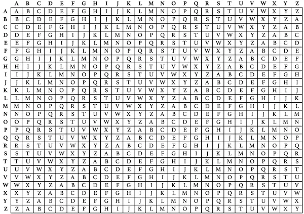

# Começando

<br/>

## Criptografia Vigenere

<br/>

A cifra de Vigenere é uma cifra de substituição que suporta criptografia e descriptografia apenas de texto alfabético.

Existe uma Tabela de Vigenere que é responsável por criptografar o texto simples com a ajuda de uma chave.
A tabela consiste em 26 linhas e colunas com cada célula armazenando uma única letra.

O armazenamento da letra começa em **AZ** na primeira linha e uma operação de deslocamento à esquerda influencia cada linha sucessiva.

<br/>



<br/>

O texto cifrado é formado por letras indexadas da tabela acima usando os nomes das linhas e colunas.

<br/>
<br/>

```c++
#include<bits/stdc++.h>
using namespace std;
// função para gerar a chave
// de forma cíclica até que seu comprimento seja
// igual ao comprimento do texto original
string generateKey(string str, string key) {
  int x = str.size();

  for (int i = 0; ; i++) {
    if (x == i)
      i = 0;
    if (key.size() == str.size())
      break;
    key.push_back(key[i]);
  }

  return key;
}
// função para retornar o texto criptografado
string cipherText(string str, string key) {
  string cipher_text;
  for (int i = 0; i < str.size(); i++) {
    // convertendo no intervalo 0-25
    char x = (str[i] + key[i]) %26;
    // converter em alfabetos (ASCII)
    x += 'A';

    cipher_text.push_back(x);
  }
  return cipher_text;
}
// esta função descriptografa o texto criptografado
// e retorna o texto original
string originalText(string cipher_text, string key) {
  string orig_text;

  for (int i = 0 ; i < cipher_text.size(); i++) {
    // convertendo no intervalo 0-25
    char x = (cipher_text[i] - key[i] + 26) %26;
    // converter em alfabetos (ASCII)
    x += 'A';
    orig_text.push_back(x);
  }
  return orig_text;
}
 
int main() {
  string str = "BarcaCommunity";
  string keyword = "BARCAWC";

  string key = generateKey(str, keyword);
  string cipher_text = cipherText(str, key);

  cout << "Texto Criptografado: " << cipher_text << "\n";
  cout << "Texto Descriptografado: " << originalText(cipher_text, key);
  
  return 0;
}
```

